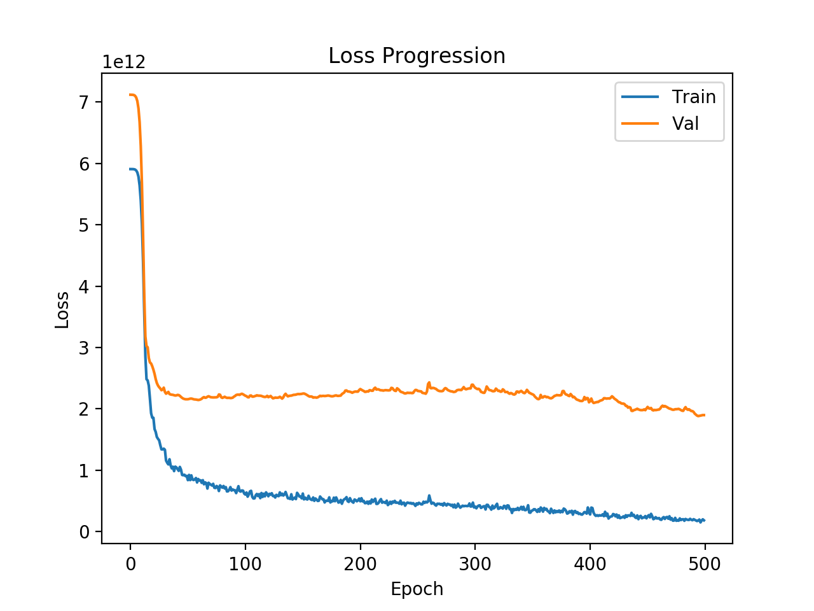

# Vancouver Housing Price Prediction

## Project Overview
Vancouver housing prices have been really stochastic over the years and prices have eratic trends. The younger population is struggling to purchase housing due to the lack of knowledge and understanding of the constantly changing real estate prices. This project serves to shed some light on the housing market in Vancouver by building a neural network to estimate the prices of houses given a set of quantitative and categorical features.

## Quick Note about the Data
As the real estate data is not public, I built a web scaper to automatically parse through the main real estate website https://www.rew.ca/. The top 500 listings (first 25 pages) was automatically parsed and put into csv files as shown in data. More listings can be attained if more pages are parsed.

The following features are used in the neural network:

* Type of house _\[House, Duplex, Apt/Condo, Townhouse\]_
* Total Square feet of the house
* Number of bedrooms
* Number of bathrooms
* Region
* City _(always Vancouver for now but added so other cities can be added in the future)_
* Address _(not used in training)_

## Performance
From the dataset of 500 currently active real estate postings, 80% of the data is used to train and 20% of the data is used to validate the data and evaluate the performance. The neural network is setup as below:

* 500 epoch
* 4 convolutional layers with 1000 neurons each
* 4 dropout layers following each convolutional layer
* 1 output layer

The output is the following:

From the graph, it is evidence that the validation data set is steadily decreasing in loss which means that the model is not overfitting the training data.

## Future Features to Implement

* Want to include more features such as
   * Land plot size
   * Year built
   * Is newly renovated
   * Days active on site
* Add more training data
* Branch into more cities in Greater Vancouver Area